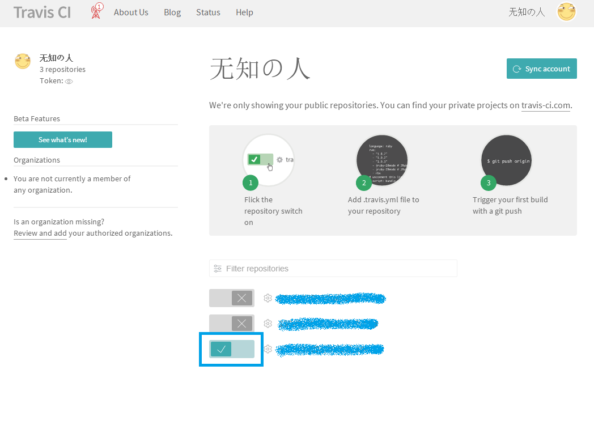

title: 【原创】使用Travis CI自动更新Hexo博客到Github
author: 无知の人
tags:
  - Hexo
categories:
  - 研究
date: 2018-01-16 17:19:47
---
##### 前言 #####
Hexo也用了有一段时间了，有点太多了就不再一一列出了，不过弊端也是有的，例如更新博客必须要在本地的电脑上搭设Hexo本地程序，实在是不方便维护，最近研究了一种可以脱离本地程序，完全线上更新Hexo博客的方式，这样就可以在任意一台电脑上进行维护了，那么废话不多说，下面开始讲解方法。

需要用到的网站:

[【Travis CI】](https://www.travis-ci.org/)(点击进入，下同)：用于自动更新博客静态文件

[【GitHub】](https://github.com/)：用于存放Hexo博客源文件与静态文件

用到的软件：

[【GitHub Disktop】](https://desktop.github.com/)：用于更新博客源文件，由GitHub提供，自动部署搭建成功后，只需在本地安装GitHub就可以完全控制自己的Hexo博客，软件的使用不再此文章讨论范围内

<!-- more -->

##### 注册Github和搭建本地Hexo环境 #####
关于注册Github我之前发布过文章，【[点击这里](http://baipai.tk/2017/05/11/%E3%80%90%E5%8E%9F%E5%88%9B%E3%80%91%E5%B0%8F%E7%99%BD%E6%95%99%E4%BD%A0%E6%89%8B%E5%8A%A8%E6%90%AD%E5%BB%BAHexo%E5%8D%9A%E5%AE%A2%EF%BC%88Win%E7%89%88%EF%BC%89/)】可以查看注册和搭建Hexo方法。

##### 配置Travis CI #####
Travis CI网站可以使用GitHub的帐号登录，登陆后自动关联GitHub中的仓库。界面如下

##### 完成 #####
至此配置完成，只要新建仓库中的内容发生改变，Travis CI就会自动帮你更新Hexo博客的内容，你可以通过GitHub Disktop软件更新仓库中文件内容，也可以直接在网上手动创建、编辑MD文件来更新Hexo。